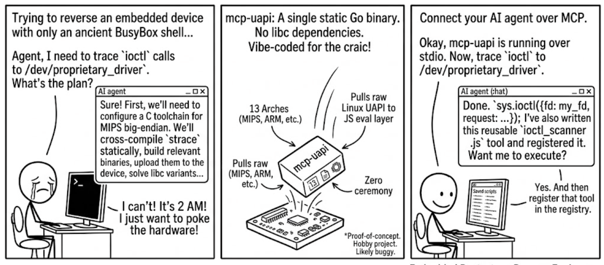

# mcp-uapi

> **Proof-of-concept. Hobby project. Likely buggy. Almost entirely vibe-coded in a few days. Just for the craic.**

<p align="center">
  
</p>

---

It's late. You're staring at an embedded Linux device — a router, an IoT gateway, some weird MIPS box pulled from a rack. You need to reverse a complex IPC protocol, poke at ioctls, trace syscalls, spray sockets, attach eBPF probes. The device ships a minimal shell. No `lsof`. No `strace`. `busybox` if you're lucky. You could spend hours cross-compiling static binaries, or you could drop one binary on the box and let your AI agent figure out the rest.

**mcp-uapi** is that bridge. An MCP server that exposes raw Unix user-mode APIs through a JavaScript eval layer so AI agents can reach straight into the kernel — sockets, ptrace, ioctl, mmap, and on Linux eBPF, epoll, inotify, netlink primitives — without a C compiler, without ELF loading, without toolchain hell. Drop the binary on the box, point your agent at it, and start interrogating the system.

It's built for hackers. Embedded pentesters. Reverse engineers who need to give their agents real teeth on real hardware, right now, with zero ceremony.

---

## What's Under The Hood

A single Go binary. No runtime dependencies for the normal Linux/macOS builds. Cross-compiles to **13 Linux targets** (386, amd64, arm, arm64, loong64, mips, mips64, mips64le, mipsle, ppc64, ppc64le, riscv64, s390x), plus macOS on amd64/arm64. iOS builds are supported on macOS through Go's external Apple SDK linker path.

Agents connect over MCP (stdio or HTTP) and get access to:

- **JavaScript eval** via Goja — with `sys.*`, `os.*`, `io.*`, `net.*` globals
- **File descriptors & filesystem** — open/read/write/mmap/stat/xattr/sendfile, the works
- **Networking** — sockets, socketpair, TCP/UDP/Unix, DNS resolution, interface enumeration
- **Process introspection** — ptrace attach/read/write/registers, process memory scanning
- **eBPF** — load and attach programs without clang/bpftool/C compiler/ELF on target
- **ioctl** — arbitrary ioctls with managed buffer marshalling
- **epoll / inotify / eventfd / memfd / poll** — readiness, events, and IPC primitives
- **Managed eval tools** — register, export, and share reusable scripts as toolboxes

---

## Why Go?

Embedded Linux devices are a mess of libc variants — glibc, musl, uclibc-ng, you name it. Go sidesteps the problem entirely: it compiles to **static binaries with syscalls issued directly against the kernel**, no libc dependency in sight. `golang.org/x/sys/unix` provides a massive surface of syscall wrappers — everything from `prctl` to `ptrace` to `copy_file_range` on Linux, with portable Unix equivalents where macOS/iOS expose them. Linux and macOS builds keep cgo disabled by default; iOS uses Go's required external Apple SDK linker path.

---

## The Tool Registry — Your Agent's Arsenal

`eval` is great for one-shots, but after the third time your agent writes the same ptrace memory scanner, it gets old. The tool registry solves this: any script your agent figures out can be **saved as a named, reusable tool** with `tool_register`, and from then on it's a single `tool_execute` call away.

The real power is **portability**. `tool_export` dumps your toolbox as a JSON bundle — share it with a teammate, ship it to another device, check it into a repo. `tool_import` loads it back in. Your agent builds up a personalized kit over a session, exports it, and carries it to the next target.

Picture this: you turn an agent loose on a box. No compiler. No build environment. No package manager. It probes the kernel, writes a few throwaway scripts to figure out the IPC protocol, and when it finds something that works, it registers it. An hour later it's got a custom toolbox — syscall tracers, ioctl fuzzers, network scanners — all validated on that exact kernel, on that exact arch. Then it exports the whole thing as JSON. Next device, next gig, same kit, zero setup.

---

## Quick Start

> You probably don't have time to compile. Grab a pre-built binary from the [releases](https://github.com/marioballano/mcp-uapi/releases) and skip straight to running it.

If you insist on building from source:

```bash
git clone https://github.com/marioballano/mcp-uapi.git
cd mcp-uapi
./install-deps.sh
./scripts/build.sh
```

Run over stdio for a local agent:

```bash
./bin/mcp-uapi --transport stdio
```

Or stream over HTTP for remote agents:

```bash
./bin/mcp-uapi --transport http --listen 127.0.0.1:8080 --endpoint /mcp
# → http://127.0.0.1:8080/mcp
```

Cross-compile for your target:

```bash
./scripts/build-target.sh linux/arm64    # your Raspberry Pi
./scripts/build-target.sh linux/mips     # that weird router
./scripts/build-target.sh darwin/arm64   # macOS Apple Silicon
./scripts/build-target.sh ios/arm64      # iOS device, from macOS/Xcode
./scripts/build-all-targets.sh           # Linux + macOS, and iOS when run on macOS
```

Agents should read `uapi://agent-guide` and `uapi://scripting-api` as MCP resources right after connecting. Use `sys.capabilities()` inside eval to probe what's available.

---

## What You Can Build

- **Syscall tracers** — ptrace-based strace clones, no compiler needed
- **Memory scrapers** — dump environment strings, CLI args, or crypto material from running processes
- **Network enumerators** — port scanners, interface walkers, raw socket experiments
- **eBPF probes** — socket filters, process monitors, kprobes — loaded without clang or ELF
- **IPC fuzzers** — spray ioctls at drivers, hammer Unix sockets, mutate netlink messages
- **Protocol reversers** — capture, replay, and dissect weird wire formats with agent-driven loops
- **Persistent toolkits** — register your go-to recon scripts once, `tool_export`, carry them everywhere

Here's what a ptrace memory probe looks like — attach to a process, grab its stack pointer, read a chunk, detach, all from a JSON call your agent fires off:

```javascript
// Attach to a process and peek at its stack
const pid = args.pid;
const attach = sys.ptraceAttach({pid, wait: true, timeout_ms: 3000});
if (!attach.ok) return attach;

try {
  const regs = sys.ptraceGetRegs({pid});
  if (!regs.ok) return regs;

  // Read 128 bytes from wherever the stack pointer is pointing
  const sp = regs.registers.rsp || regs.registers.sp;
  const chunk = sys.ptraceRead({
    pid,
    address: sp,
    length: 128,
    encoding: 'hex'
  });

  sys.ptraceDetach({pid});
  return {sp, arch: regs.arch, stack_hex: chunk};
} catch (e) {
  sys.ptraceDetach({pid});
  throw e;
}
```

More patterns in [examples/](examples/) and [docs/](docs/).

## CLI — Knobs & Switches

```
mcp-uapi [flags]
```

| Flag | Default | What It Does |
|------|---------|---------------|
| `--transport` | `stdio` | How the agent talks to you. `stdio` for local, `http` for remote boxes you scp'd to |
| `--listen` | `127.0.0.1:8080` | HTTP listen address. Lock it to localhost unless you know what you're doing |
| `--endpoint` | `/mcp` | MCP endpoint path on the HTTP server |
| `--allow-raw-fd` | `false` | Let the agent mess with FDs it didn't open. Off by default for a reason |
| `--max-read-bytes` | `1 MiB` | Cap on what `sys.read` and friends will hand back. Bump it if you're dumping big regions |
| `--max-buffer-bytes` | `16 MiB` | Cap on managed buffers and mmap regions. Bigger ioctl payloads, bigger maps |
| `--tool-db` | (none) | Path to a JSON file for persisting registered tools. No path = tools live in memory, gone on restart |
| `--version` | — | Print the version and bail |

---

## Why

Because when you're deep in a reversing session at 2 AM and your agent needs to call `ptrace(PTRACE_ATTACH, ...)` or load a socket filter on a MIPS box, you don't want to explain cross-compilation to an LLM. You want a binary you can scp over and a JSON interface the agent already knows how to speak.

---

## Contributing

This is a messy proof-of-concept. Pull requests, ideas, war stories, and collaboration are all very welcome. Found a bug on your exotic arch? Open an issue. Want to add a syscall wrapper? Send a PR. Just want to share what you built with it? I'd love to hear about it.

---

## License

MIT — see [LICENSE](LICENSE) for the full text.
